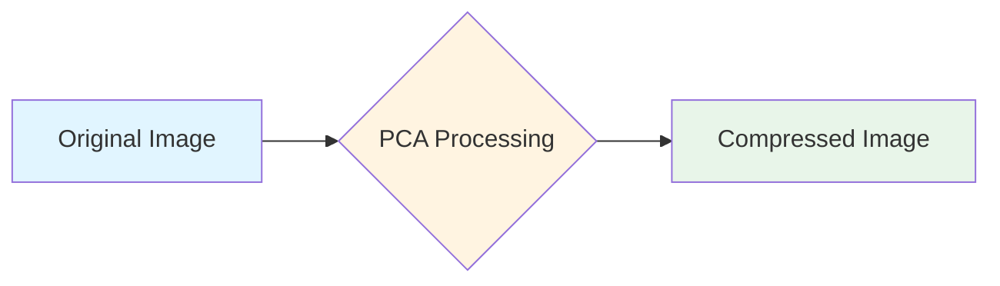
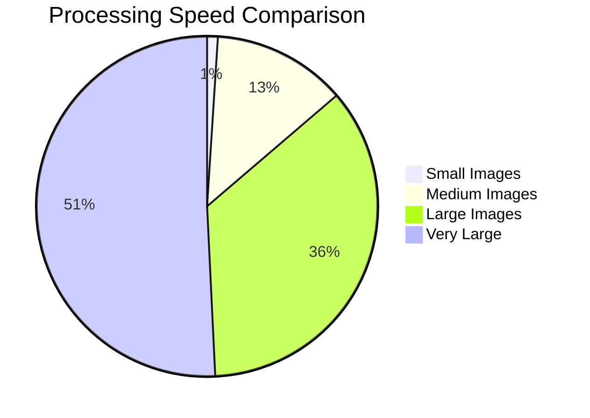
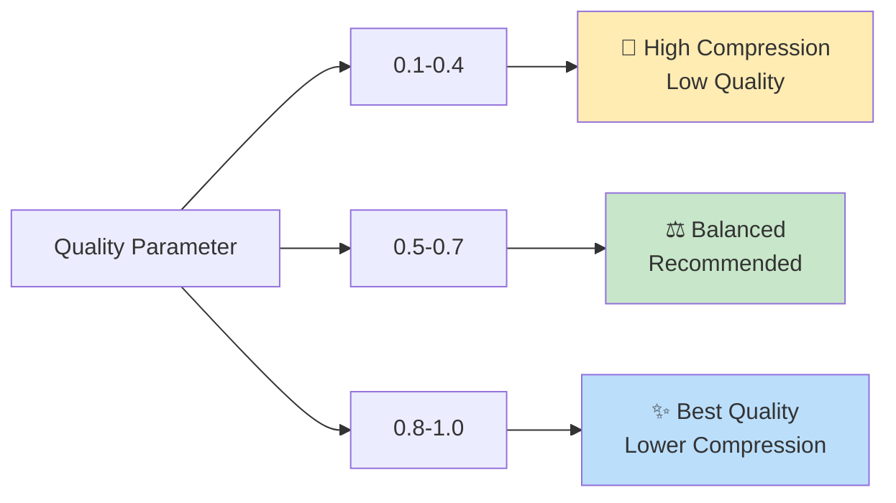
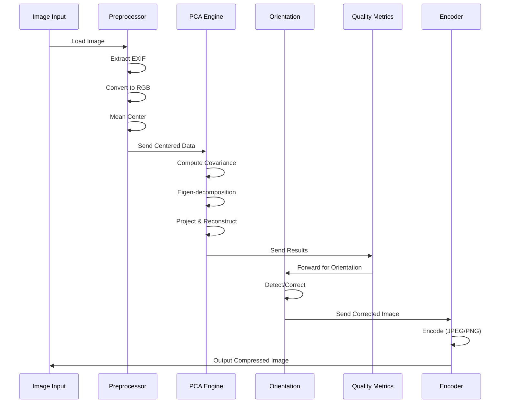

# ✨ PCA Compressor

<div align="center">

  # 🚀 Efficient Image Compression with PCA

  **A powerful, cross-platform tool for intelligent image compression**

  [](https://github.com/kushalchalla981-tech/mathproj/actions)
  [](https://github.com/kushalchalla981-tech/mathproj/releases)
  [](https://github.com/kushalchalla981-tech/mathproj/blob/main/LICENSE)
  [](https://www.rust-lang.org/)
  [](https://www.python.org/)

  [Features](#-features) • [Quick Start](#-quick-start) • [Architecture](#-architecture) • [Documentation](#-documentation)

</div>

---

## 💫 Features

<div align="center">

<table>
  <tr>
    <td align="center" width="20%">
      
      <br><br><b>Core Library</b>
    </td>
    <td width="80%">
      <ul>
        <li>🎯 <b>PCA-based Compression</b> - Principal Component Analysis for optimal dimensionality reduction</li>
        <li>🔄 <b>Auto Orientation</b> - Smart orientation detection using PCA & EXIF</li>
        <li>🧩 <b>Tile Processing</b> - Memory-safe processing for large images</li>
        <li>📊 <b>Quality Metrics</b> - SSIM & PSNR for quality assessment</li>
      </ul>
    </td>
  </tr>
  <tr>
    <td align="center" width="20%">
      
      <br><br><b>Python Bindings</b>
    </td>
    <td width="80%">
      <ul>
        <li>🐍 <b>PyO3 Integration</b> - Native Python bindings with zero-copy capabilities</li>
        <li>⚡ <b>Fast Processing</b> - Rust-powered performance from Python</li>
        <li>🔧 <b>Easy API</b> - Simple, intuitive interface</li>
        <li>📦 <b>PyPI Ready</b> - Easy installation via pip</li>
      </ul>
    </td>
  </tr>
  <tr>
    <td align="center" width="20%">
      
      <br><br><b>Powerful CLI</b>
    </td>
    <td width="80%">
      <ul>
        <li>⌨️ <b>Single & Batch</b> - Process individual or multiple images</li>
        <li>📈 <b>CSV Reports</b> - Detailed batch processing statistics</li>
        <li>🎛️ <b>Full Control</b> - Comprehensive parameter tuning</li>
        <li>🚄 <b>Parallel Processing</b> - Multi-threaded batch operations</li>
      </ul>
    </td>
  </tr>
  <tr>
    <td align="center" width="20%">
      
      <br><br><b>Desktop GUI</b>
    </td>
    <td width="80%">
      <ul>
        <li>🎨 <b>Modern Interface</b> - Clean, intuitive design</li>
        <li>👀 <b>Live Preview</b> - Real-time compression preview</li>
        <li>⚙️ <b>Easy Tuning</b> - Interactive compression settings</li>
        <li>🖼️ <b>Side-by-Side</b> - Before/after comparison</li>
      </ul>
    </td>
  </tr>
</table>

</div>

---

## 🎨 Visual Comparison

<div align="center">



**Compression Modes:**

| Mode | Description | Best For | Speed |
|------|-------------|----------|-------|
| 🎨 Per-Channel | Process each RGB channel independently | Natural photos | ⚡⚡⚡ Fast |
| 🌈 Joint-Channel | Treat RGB as 3D data vectors | Graphics, colorful images | ⚡⚡ Medium |

</div>

---

## 🚀 Quick Start

<div align="center">

### Installation

```bash
# Clone the repository
git clone https://github.com/kushalchalla981-tech/mathproj.git
cd mathproj/pca-compressor

# Build all components
./build.sh --release --all

# Or install Python package
pip install pca-compressor
```

### Usage Examples

</div>

#### 🖥️ CLI Usage

```bash
# Basic compression
pca-compress single input.jpg --quality 0.7

# Batch processing with reports
pca-compress batch ./photos/ -o ./compressed/ --report results.csv
```

#### 🐍 Python Usage

```python
from pca_compressor import compress_file, CompressionParams

params = CompressionParams(quality=0.7, mode='per-channel')
result = compress_file('input.jpg', 'output.jpg', params)
print(f"✓ SSIM: {result.ssim:.3f}, Compression: {result.compression_ratio:.2f}x")
```

#### 📱 Library Usage (Rust)

```rust
use pca_core::prelude::*;

let image = load_image("input.jpg")?;
let params = CompressionParams::default().with_quality(0.7);
let result = compress(&image, &params)?;
save_image("output.jpg", &result.image, 90)?;
```

---

## 🏗️ Architecture

<div align="center">

```
┌─────────────────────────────────────────────────────────────┐
│  📱 Client Layer    │  CLI │  GUI │  Python Bindings      │
├─────────────────────────────────────────────────────────────┤
│  ⚙️ Service Layer   │  Compression Service │ Quality      │
├─────────────────────────────────────────────────────────────┤
│  🧮 Core Compute    │  PCA Engine │ Eigen | Tile Proc     │
├─────────────────────────────────────────────────────────────┤
│  🔧 Utility Layer   │  Image I/O │ EXIF │ Encoding        │
└─────────────────────────────────────────────────────────────┘
```

</div>

### Project Structure

```
pca-compressor/
├── 📦 crates/
│   ├── 🔹 pca-core/         # Core library
│   ├── 🔹 pca-cli/          # CLI tool
│   ├── 🔹 pca-py/           # Python bindings
│   └── 🔹 pca-gui/          # Desktop GUI
├── 🧪 tests/                # Test suite
├── 📚 docs/                 # Documentation
└── 🐍 python-proto/         # Python reference implementation
```

---

## 📊 Performance Metrics

<div align="center">

| Image Size | Processing Time | Memory Usage | Quality Target |
|------------|-----------------|--------------|---------------|
| 🖼️ Small (<1MP) | <100ms | ~50MB | SSIM > 0.95 |
| 📸 Medium (1-4MP) | 500ms-2s | ~200MB | SSIM > 0.90 |
| 🖼️ Large (4-12MP) | 2-5s | ~500MB | SSIM > 0.85 |
| 🏞️ Very Large (>12MP) | Variable | Configurable | SSIM > 0.80 |

</div>

<div align="center">



</div>

---

## 🎯 Quality Trade-offs

<div align="center">



**Quality Guidelines:**

- 🎵 **Low Quality (0.1-0.4)**: Archival, thumbnails
  - Highest compression ratio
  - Faster processing
  - Good for storage optimization

- ⚖️ **Balanced (0.5-0.7)**: Web sharing, social media
  - Good quality/size balance
  - Recommended for most use cases

- ✨ **High Quality (0.8-1.0)**: Photography, printing
  - Best visual quality
  - Lower compression
  - Professional use

</div>

---

## 🛠️ Advanced Features

<div align="center">

### 🧩 Tile Processing
<div style="background: #f5f5f5; padding: 15px; border-radius: 10px; margin: 20px 0;">
  <b>Why Tile Processing?</b>
  <ul>
    <li>🎯 Handle images larger than available memory</li>
    <li>⚡ Parallel processing for faster compression</li>
    <li>🛡️ Memory-safe operation with configurable limits</li>
    <li>🔄 Seam-aware blending for smooth results</li>
  </ul>
</div>

### 🧭 Orientation Correction
<div style="background: #e3f2fd; padding: 15px; border-radius: 10px; margin: 20px 0;">
  <b>Smart Orientation Detection</b>
  <ul>
    <li>🔬 <b>PCA-based</b>: Uses principal axis analysis for orientation</li>
    <li>📋 <b>EXIF Fallback</b>: Automatically uses EXIF when PCA confidence is low</li>
    <li>🎚️ <b>Standard Rotations</b>: Support for 0°, 90°, 180°, 270°</li>
    <li>⚙️ <b>Configurable</b>: Enable/disable or force specific method</li>
  </ul>
</div>

</div>

---

## 📈 Technical Specifications

### PCA Algorithm

1. **Step 1: Mean Centering**
   ```
   X_centered = X - mean(X)
   ```

2. **Step 2: Covariance Matrix**
   ```
   C = (X_centeredᵀ × X_centered) / (n-1)
   ```

3. **Step 3: Eigen-decomposition**
   ```
   C × v = λ × v
   ```

4. **Step 4: Projection**
   ```
   Y = X_centered × V_k
   ```

5. **Step 5: Reconstruction**
   ```
   X_reconstructed = (Y × V_kᵀ) + mean(X)
   ```

### Memory Management

```rust
// Automatic memory estimation
let estimated_mb = (image.size_bytes() as f64 / (1024.0 * 1024.0)) * 3.0;

// Configurable limits
let params = CompressionParams {
    max_memory_mb: Some(1024), // 1GB limit
    ..Default::default()
};
```

---

## 🚦 Build Status

<div align="center">

[](https://github.com/kushalchalla981-tech/mathproj/actions)
[](https://github.com/kushalchalla981-tech/mathproj/actions)
[](https://github.com/kushalchalla981-tech/mathproj)

Supported Platforms:


</div>

---

## 📚 Documentation

<div align="center">

| Document | Description | Link |
|----------|-------------|------|
| 📖 README | Project overview | [View](README.md) |
| 🚀 Quick Start | Get started quickly | [View](pca-compressor/docs/QUICKSTART.md) |
| 🔧 API Reference | Detailed API documentation | [View](pca-compressor/docs/API.md) |
| 🏗️ Architecture | System design | [View](pca-compressor/docs/architecture.md) |
| ⚡ Performance | Optimization guide | [View](pca-compressor/docs/performance.md) |
| 🔧 Troubleshooting | Common issues | [View](pca-compressor/docs/troubleshooting.md) |

</div>

---

## 🎪 Use Cases

<div align="center">

<table>
  <tr>
    <td align="center">
      <div style="background: #e3f2fd; padding: 20px; border-radius: 15px; width: 280px;">
        <h3>🌐 Web Optimization</h3>
        <p>Compress images for websites and applications with balanced quality and file size</p>
        <code>pca-compress batch ./web/ -o ./opt/ --quality 0.7</code>
      </div>
    </td>
    <td align="center">
      <div style="background: #f3e5f5; padding: 20px; border-radius: 15px; width: 280px;">
        <h3>📸 Photo Archival</h3>
        <p>Archive personal photos with high-quality compression</p>
        <code>pca-compress single photo.jpg --quality 0.85</code>
      </div>
    </td>
    <td align="center">
      <div style="background: #e8f5e9; padding: 20px; border-radius: 15px; width: 280px;">
        <h3>📊 Batch Processing</h3>
        <p>Process entire photo collections efficiently</p>
        <code>pca-compress batch ./photos/ -o ./compressed/ --report csv</code>
      </div>
    </td>
  </tr>
  <tr>
    <td align="center">
      <div style="background: #fff3e0; padding: 20px; border-radius: 15px; width: 280px;">
        <h3>🎨 Graphic Design</h3>
        <p>Compress artwork and graphics with joint-channel mode</p>
        <code>pca-compress single art.png --mode joint-channel</code>
      </div>
    </td>
    <td align="center">
      <div style="background: #fce4ec; padding: 20px; border-radius: 15px; width: 280px;">
        <h3>📱 Mobile Apps</h3>
        <p>Optimize images for mobile devices and networks</p>
        <code>pca-compress single image.jpg --quality 0.6 --tile-size 256</code>
      </div>
    </td>
    <td align="center">
      <div style="background: #f1f8e9; padding: 20px; border-radius: 15px; width: 280px;">
        <h3>🔬 Research</h3>
        <p>Exploratory analysis of PCA compression effects</p>
        <code>rust: compress(&image, params)?;</code>
      </div>
    </td>
  </tr>
</table>

</div>

---

## 🎓 Algorithm Details

### PCA Compression Pipeline

<div align="center">



</div>

---

## 🌟 Highlights

<div align="center">

### ✨ What Makes PCA Compressor Special?

| Feature | Our Implementation | Traditional Codecs |
|---------|---------------------|-------------------|
| 🧠 Algorithm | PCA-based dimensionality reduction | DCT-based (JPEG) |
| 🎯 Explainability | Fully transparent parameters | Black-box compression |
| 🔄 Deterministic | Same input → same output | Varies by implementation |
| 🧭 Orientation | PCA + EXIF dual approach | EXIF only |
| ⚙️ Tunable | Fine-grained parameter control | Limited options |
| 📊 Metrics | Built-in SSIM/PSNR | External tools needed |

### 🚀 Performance Characteristics

- **Deterministic Processing**: Guaranteed identical outputs
- **Memory-safe**: No buffer overflows or memory leaks
- **Thread-safe**: Parallel processing without data races
- **Cross-platform**: Same results on Linux, macOS, Windows

</div>

---

## 💯 Quality Benchmarks

<div align="center">

### SSIM Quality Targets

```
📊 Quality Scale (SSIM)

✅ 0.95 - 1.00  Excellent (Professional use)
✅ 0.90 - 0.95  Good     (Web sharing)
✅ 0.80 - 0.90  Acceptable (Storage)
❌ < 0.80        Poor    (Not recommended)
```

### Compression Ratio vs Quality

| Quality Level | Compression Ratio | SSIM Target | Use Case |
|---------------|-------------------|-------------|----------|
| 🎵 High Compression | 3x - 5x | 0.85 | Archival |
| ⚖️ Balanced | 2x - 3x | 0.90 | Web |
| ✨ Best Quality | 1.5x - 2x | 0.95 | Professional |

</div>

---

## 🔮 Future Roadmap

<div align="center">

### 🎯 Phase 3+ Enhancements

| Feature | Status | Target |
|---------|--------|--------|
| HTTP API | 🚧 Planned | Q2 2025 |
| GPU Acceleration | 📋 Research | Q3 2025 |
| Streaming Compression | 📋 Research | Q3 2025 |
| Adaptive Quality | 📋 Research | Q2 2025 |
| Plugin Architecture | 📋 Research | After V1 |

</div>

---

## 🤝 Contributing

<div align="center">

We welcome contributions! Here's how you can help:

### 🛠️ Development

```bash
# Fork and clone
git clone https://github.com/yourusername/mathproj.git
cd mathproj

# Create feature branch
git checkout -b feature/amazing-feature

# Make your changes
cargo test

# Commit and push
git commit -m "Add amazing feature"
git push origin feature/amazing-feature

# Create Pull Request
```

### 📝 Guidelines

- Follow Rust naming conventions
- Add tests for new features
- Update documentation
- Ensure CI/CD passes

### 🎨 Areas for Contribution

- 🔧 Performance optimizations
- 🌐 Additional image format support
- 📱 Mobile native apps
- 🧪 Test coverage expansion
- 📚 Documentation improvements

</div>

---

## 📜 License

<div align="center">

```
MIT License

Copyright (c) 2025 PCA Compressor Team

Permission is hereby granted, free of charge, to any person obtaining a copy
of this software and associated documentation files (the "Software"), to deal
in the Software without restriction, including without limitation the rights
to use, copy, modify, merge, publish, distribute, sublicense, and/or sell
copies of the Software, and to permit persons to whom the Software is
furnished to do so, subject to the following conditions:

The above copyright notice and this permission notice shall be included in all
copies or substantial portions of the Software.

THE SOFTWARE IS PROVIDED "AS IS", WITHOUT WARRANTY OF ANY KIND, EXPRESS OR
IMPLIED, INCLUDING BUT NOT LIMITED TO THE WARRANTIES OF MERCHANTABILITY,
FITNESS FOR A PARTICULAR PURPOSE AND NONINFRINGEMENT.
```

</div>

---

## 🙏 Acknowledgments

<div align="center">

<div style="background: linear-gradient(135deg, #667eea 0%, #764ba2 100%); padding: 20px; border-radius: 15px; color: white;">

### Built With ❤️ Using

- **Rust** - For performance and safety
- **NumPy & Pillow** - Python reference implementation
- **Tauri** - Desktop application framework
- **nalgebra** - Linear algebra computations

### Inspired By

- Principal Component Analysis research
- Image compression literature
- Open-source community 💙

</div>

</div>

---

## 📬 Contact & Support

<div align="center">

<table>
  <tr>
    <td align="center">
      <a href="https://github.com/kushalchalla981-tech/mathproj/issues">
        
      </a>
    </td>
    <td align="center">
      <a href="https://github.com/kushalchalla981-tech/mathproj/discussions">
        
      </a>
    </td>
    <td align="center">
      <a href="https://github.com/kushalchalla981-tech/mathproj">
        
      </a>
    </td>
  </tr>
</table>

### 🔗 Quick Links

- 🌐 [Documentation](https://github.com/kushalchalla981-tech/mathproj/tree/main/docs)
- 📦 [Releases](https://github.com/kushalchalla981-tech/mathproj/releases)
- 📊 [GitHub Actions](https://github.com/kushalchalla981-tech/mathproj/actions)
- 🐍 [PyPI](https://pypi.org/project/pca-compressor/)

</div>

---

<div align="center">

### ⭐ Star this repository if you find it helpful!

<div style="margin-top: 30px;">

[](https://github.com/kushalchalla981-tech/mathproj)
[](https://github.com/kushalchalla981-tech/mathproj)

</div>

</div>