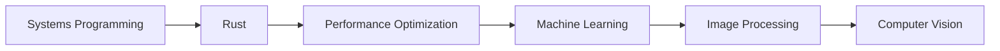

# 🚀 Kushal Challa

<div align="center">

  <h2>👨‍💻 Full-Stack Developer | Rust Enthusiast | Open Source Contributor</h2>

  
  
  
  

</div>

---

## 🎯 About Me

<div align="center">

```javascript
const developer = {
  name: "Kushal Challa",
  role: "Full-Stack Developer",
  location: "India",
  languages: ["Rust", "Python", "JavaScript", "C++"],
  interests: ["Systems Programming", "Image Processing", "Machine Learning"],
  approach: "Building efficient, performant, and beautiful software"
};

console.log(developer.approach);
```

🔭 I'm an enthusiastic developer focused on building **high-performance applications** using cutting-edge technologies like **Rust** and **Machine Learning**. I love creating tools that make a difference.

</div>

---

## 🌟 Featured Project

<div align="center">

### 🖼️ PCA Compressor

A powerful, efficient image compression tool based on Principal Component Analysis.

<div style="background: linear-gradient(135deg, #667eea 0%, #764ba2 100%); padding: 30px; border-radius: 15px; color: white; margin: 20px 0;">

**Features:**
- 🎯 PCA-based compression algorithm
- 🧩 Memory-safe tile processing
- 📊 Quality metrics (SSIM, PSNR)
- 🚀 CLI, Python, and GUI interfaces
- 🌐 Cross-platform support

</div>

[](https://github.com/kushalchalla981-tech/mathproj)
[](https://www.rust-lang.org/)
[](https://www.python.org/)

</div>

---

## 🛠️ Tech Stack

<div align="center">

### Languages
[](https://www.rust-lang.org/)
[](https://www.python.org/)
[](https://www.javascript.com/)
[](https://cplusplus.com/)

### Frameworks
[](https://reactjs.org/)
[](https://nodejs.org/)
[](https://tauri.app/)

### Tools
[](https://git-scm.com/)
[](https://code.visualstudio.com/)
[](https://www.docker.com/)

</div>

---

## 📈 GitHub Stats

<div align="center">


</div>

---

## 🏆 Contributions

<div align="center">

### 📁 Repositories

| Project | Stars | Forks | Status |
|---------|-------|-------|--------|
| [PCA Compressor](https://github.com/kushalchalla981-tech/mathproj) | ⭐ Coming! | 🍴  | 🚀 Active |

</div>

---

## 🎓 Learning Path

<div align="center">

### 📚 What I'm Learning



- 🦀 **Rust** - Memory safety without performance trade-offs
- 🧠 **Machine Learning** - PCA, neural networks, optimization
- 🖼️ **Computer Vision** - Image processing, compression algorithms
- ⚡ **Performance Engineering** - Optimization, profiling, benchmarking

</div>

---

## 📫 Get In Touch

<div align="center">

### 🎯 Let's Connect!

<div style="margin: 20px 0;">

[](https://github.com/kushalchalla981-tech)
[](https://www.linkedin.com/in/yourusername)
[](https://twitter.com/yourusername)

</div>

### 📧 Email
📮 kushalchalla981@gmail.com

---

<div align="center">

## ⭐ Star History


<div style="margin-top: 20px;">

> "Code is like humor. When you have to explain it, it's bad." – Cory House

</div>

---

<div align="center">

### 🙏 Thanks for visiting!

<div style="background: linear-gradient(135deg, #667eea 0%, #764ba2 100%); padding: 20px; border-radius: 15px; color: white; margin: 30px 0;">

**Built with ❤️ using Rust & Python**

</div>

</div>